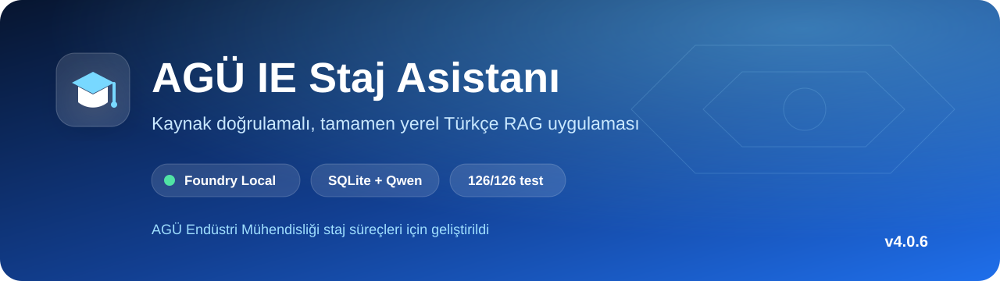
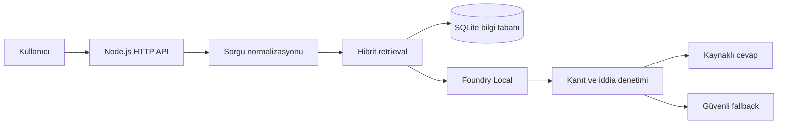

<p align="center">
  
</p>

<p align="center">
  <a href="https://nodejs.org/"></a>
  <a href="https://github.com/microsoft/Foundry-Local"></a>
  
  
  <a href="LICENSE"></a>
</p>

<p align="center">
  <strong>AGÜ Endüstri Mühendisliği staj belgelerini kaynak göstererek yanıtlayan, tamamen yerel Türkçe RAG uygulaması.</strong>
</p>

## Proje özeti

AGÜ IE Staj Asistanı, Abdullah Gül Üniversitesi Endüstri Mühendisliği Bölümü staj süreçleri için geliştirildi. Uygulama soruları yerel belgelerde arar, seçilen kanıtları yerel dil modeline verir ve cevaptaki kritik iddiaları kaynaklarla karşılaştırır. Çalışma sırasında soru ve belgeler harici bir LLM servisine gönderilmez.

| Özellik | Uygulama |
|---|---|
| Yerel yapay zekâ | Microsoft Foundry Local + `qwen2.5-0.5b` |
| Anlamsal arama | `qwen3-embedding-0.6b`, 1024 boyutlu embedding |
| Bilgi tabanı | SQLite, 17 belge ve 30 kanıt pasajı |
| Retrieval | Semantik ve sözcüksel hibrit sıralama |
| Güvenilirlik | Sayı, tarih, oran ve kritik iddia doğrulaması |
| Güvenli fallback | Kaynak cümlesi veya açık “bilgi yok” cevabı |
| Doğrulama | 126/126 otomatik test, 10/10 tanılama kontrolü |

## Neden farklı?

- **Kaynak temelli cevap:** Her cevap seçilen yerel belge pasajlarıyla ilişkilendirilir.
- **Hallucination kontrolü:** Kanıtta bulunmayan sayısal ve metinsel iddialar kullanıcıya gösterilmez.
- **Hızlı kanıt yolu:** Açık ve sık sorulan sorular, statik cevap tablosu kullanılmadan doğrudan doğrulanmış pasajlardan yanıtlanır.
- **Kapsam kontrolü:** Alan dışı sorular modele gönderilmeden güvenli biçimde reddedilir.
- **Yerel çalışma:** İlk model indirmesinden sonra çalışma zamanında bulut API’si veya API anahtarı gerekmez.

## Mimari



## Örnek davranış

| Soru | Beklenen davranış |
|---|---|
| “Mezun olmadan önce kaç ayrı staj tamamlamalıyım?” | IE 197, IE 297 ve IE 397 aşamalarını kaynakla açıklar |
| “IE 197, IE 297 ve IE 397 ayrı ayrı kaç iş günüdür?” | 20, 30 ve 30 iş gününü ders kodlarıyla eşler |
| “2027 başvuru son tarihi nedir?” | Kaynakta olmayan tarihi tahmin etmez |
| “Kayseri’de hava nasıl?” | Sorunun uygulama kapsamı dışında olduğunu belirtir |

## Hızlı başlangıç

### Gereksinimler

- Windows x64
- Node.js 22 LTS (`>=22.13.0 <24`)
- Güncel Visual C++ Redistributable
- İlk kurulum ve model indirmesi için internet bağlantısı

Projeyi OneDrive veya SharePoint dışında normal bir yerel klasöre çıkarın.

### Kolay kurulum

İlk kullanımda `KURULUM.cmd`, sonraki açılışlarda `BASLAT.cmd` dosyasını çalıştırın. Arayüz hazır olduğunda [http://127.0.0.1:3000](http://127.0.0.1:3000) adresini açın.

### Terminalden kurulum

```powershell
npm.cmd install
npm.cmd run diagnose:foundry
npm.cmd run ingest
npm.cmd test
npm.cmd run diagnose
npm.cmd start
```

## Proje yapısı

```text
├── src/                  # RAG, Foundry Local, API ve güvenlik katmanı
├── public/               # Yerel web arayüzü
├── docs/                 # Yapılandırılmış bilgi belgeleri
├── sources/              # Kanonik kaynaklar ve SHA-256 manifesti
├── data/knowledge.db     # SQLite bilgi tabanı
├── test/                 # Birim ve entegrasyon testleri
├── SUNUM/                # Beş dakikalık proje sunumu
├── KURULUM.cmd           # İlk kurulum
└── BASLAT.cmd            # Sonraki çalıştırmalar
```

## Komutlar

| Komut | Amaç |
|---|---|
| `npm run diagnose:foundry` | SDK, Windows çekirdeği ve model kataloğunu kontrol eder |
| `npm run ingest` | Belgeleri ayrıştırır ve gerçek embeddinglerle SQLite DB’yi oluşturur |
| `npm test` | Birim, entegrasyon, retrieval, güvenlik ve HTTP testlerini çalıştırır |
| `npm run diagnose` | Node, belge, DB, embedding ve arayüz durumunu kontrol eder |
| `npm run live-eval` | Gerçek yerel modellerle isteğe bağlı kalite değerlendirmesi yapar |
| `npm start` | Yerel web uygulamasını başlatır |

## API

| Metot | Uç nokta | Amaç |
|---|---|---|
| `GET` | `/api/health` | Hazır olma ve bileşen durumu |
| `GET` | `/api/stats` | Yerel sorgu performansı özeti |
| `GET` | `/api/docs` | İndekslenmiş belgeler |
| `POST` | `/api/chat` | Kaynak doğrulamalı soru-cevap |
| `POST` | `/api/upload` | Yerel `.md` veya `.txt` belge ekleme |

Ayrıntılı sözleşme için [API_REFERENCE.md](API_REFERENCE.md) dosyasına bakın.

## Doğrulama ve raporlar

- [Test raporu](TEST_REPORT.md)
- [Kalite raporu](QUALITY_REPORT.md)
- [Performans notları](PERFORMANCE.md)
- [Mimari açıklaması](ARCHITECTURE.md)
- [Windows kurulum rehberi](SETUP_WINDOWS.md)
- [Sorun giderme](INSTALLATION_TROUBLESHOOTING.md)
- [5 dakikalık sunum](SUNUM/AGU_IE_Staj_Asistani_5_Dakika.pptx)

## Kaynak bütünlüğü

Beş kanonik dosya `sources/original/` altında korunur. `sources/manifest.json` dosya adı, boyut ve SHA-256 değerlerini içerir. Uygulama cevap üretirken yapılandırılmış `docs/` belgelerini kullanır; bir çelişki oluşursa özgün kaynak esas alınır.

## Kapsam ve sınırlamalar

- Uygulama yalnızca AGÜ Endüstri Mühendisliği staj süreçlerini kapsar.
- Güncel duyuru, kişisel durum veya kaynaklarda bulunmayan tarihleri doğrulayamaz.
- Model önbellekleri ve `node_modules` depoya eklenmemiştir.
- İlk kurulumun süresi donanıma ve model indirme hızına bağlıdır.

## Lisans

Kaynak kod [MIT Lisansı](LICENSE) ile yayımlanmıştır. Depodaki kurumsal belge ve görsellerin hakları kendi sahiplerine aittir.
